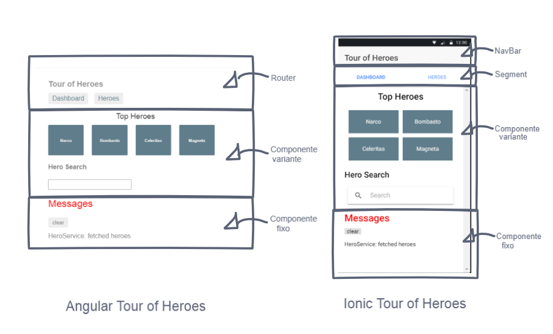

# Ionic Tour of Heroes

<p>Uma versão em Ionic do tutorial Tour of Heroes, produzido em Angular.</p>
<p>Link do tutorial: https://angular.io/tutorial</p>

<p>Todo código foi adaptado e foram seguidos os conceitos originais de Estrutura de Arquivos, 
Data Binding, Orientação a Objetos, Hierarquia de Componentes, Serviços e HTTP. A principal diferença 
se encontra na navegação [veja a diferença aqui](#navegação), além do uso de componentes e conceitos próprios do Ionic.</p>

# Navegação

<p>Enquanto no Angular a navegação é feita através de URLS,[Veja aqui](https://angular.io/guide/router), 
no Ionic a navegação entre paginas é usualmente feita em cima de uma classe que empilha as paginas para mostrá-las.
O Angular é uma framework que foi estruturada para servir a Single Page Applications, portanto, no tutorial a gente tem uma
única pagina que troca entre componentes. </p>
<p>Para levar esse conceito pro Ionic, eis o que foi feito nesse projeto: foi criado uma única 
pagina e para alternar entre componentes foi utilizado o componente [Segment](https://ionicframework.com/docs/components/#segment), assim,
evita-se a criação de novas páginas. Adicionalmente, um provider foi criado e instanciado uma única vez na aplicação toda, nele, encontra-se
a variável que controla o Segment.</p>
<h4>Exemplificação:</h4> <br>


#Testando o Projeto

**Para testar pelo Ionic View, use o seguinte ID: a8048e2e**
Para obter uma cópia deste repositório e rodar onde quiser:
```
git clone https://github.com/guilhermebpereira/ionic-tour-of-heroes.git
npm install
ionic serve
```
